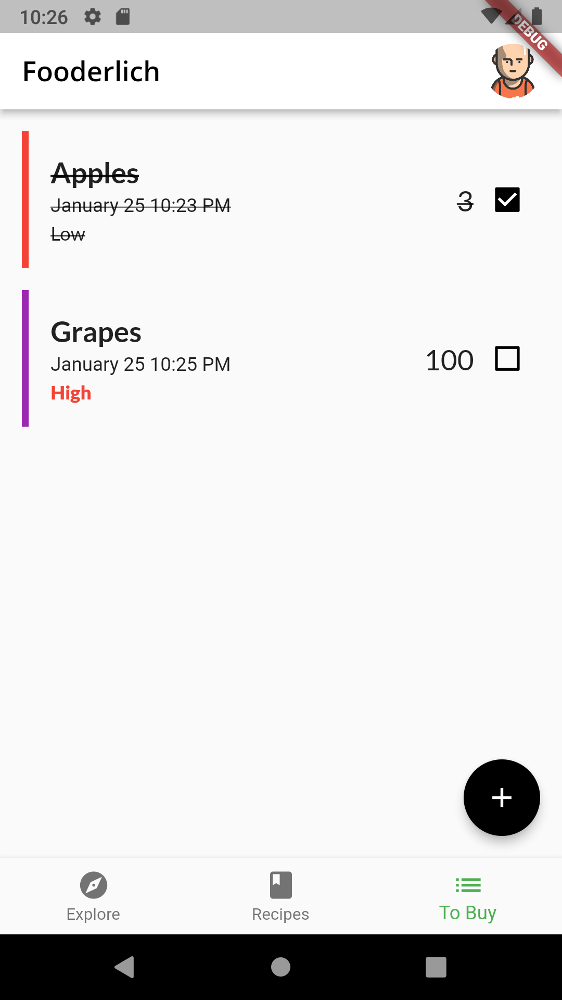
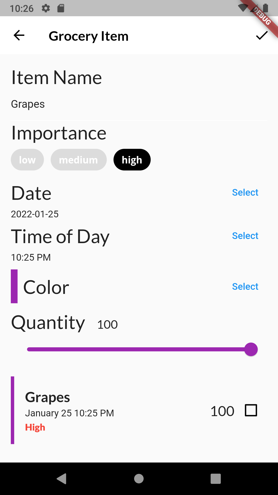

# Fooderlich
This is a Flutter project called Fooderlich which is a recipe app described in Flutter Apprentice Book on www.raywenderlich.com

Link for the book: https://www.raywenderlich.com/books/flutter-apprentice

Github link for the book materials: https://github.com/raywenderlich/flta-materials

Image credits or attributions are added in image_attributions.txt

Screenshots of the app are attached here :

|Explore Screen|Friends Posts|Recipes Screen|
|--------------|-------------|--------------|
||||

|Groceries Screen|Grocery Item Screen|Profile Screen|
|--------------|-------------|--------------|
||||
